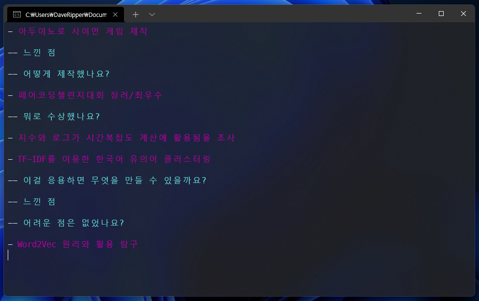

# Exigo
University interview helper with expected questions



## 동작 방식
`exigo.exe` 파일과 같은 경로에 `questions.txt` 파일이 존재해야 동작합니다.
`questions.txt` 파일은 다음과 같은 형식으로 구성됩니다.

```
- 질문 주제 1
-- 질문 1
--- (꼬리 질문) 질문 1-1
---- (꼬리 질문) 질문 1-1-1
- 질문 주제 2
-- 질문 1
--- (꼬리 질문) 질문 1-1
```

`-` 문자의 개수로 질문의 깊이를 표현합니다. `-` 문자 다음에는 반드시 공백이 있어야 합니다.
